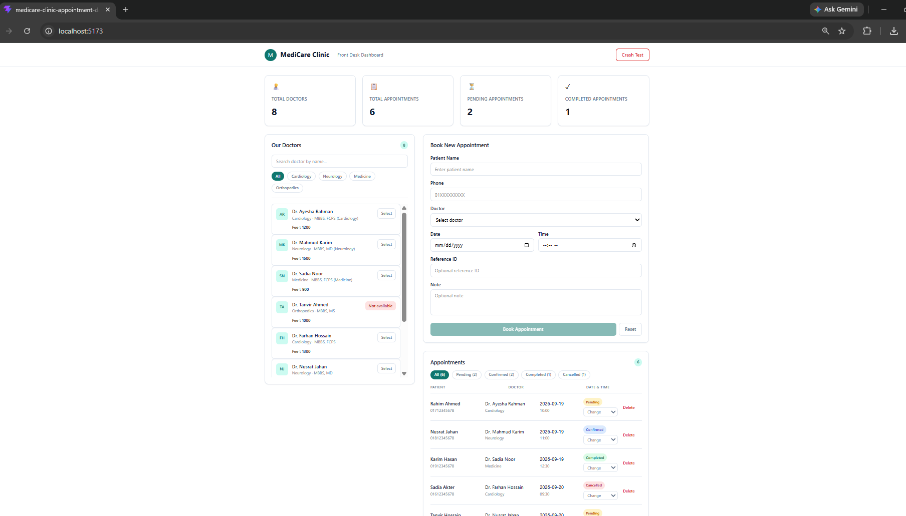
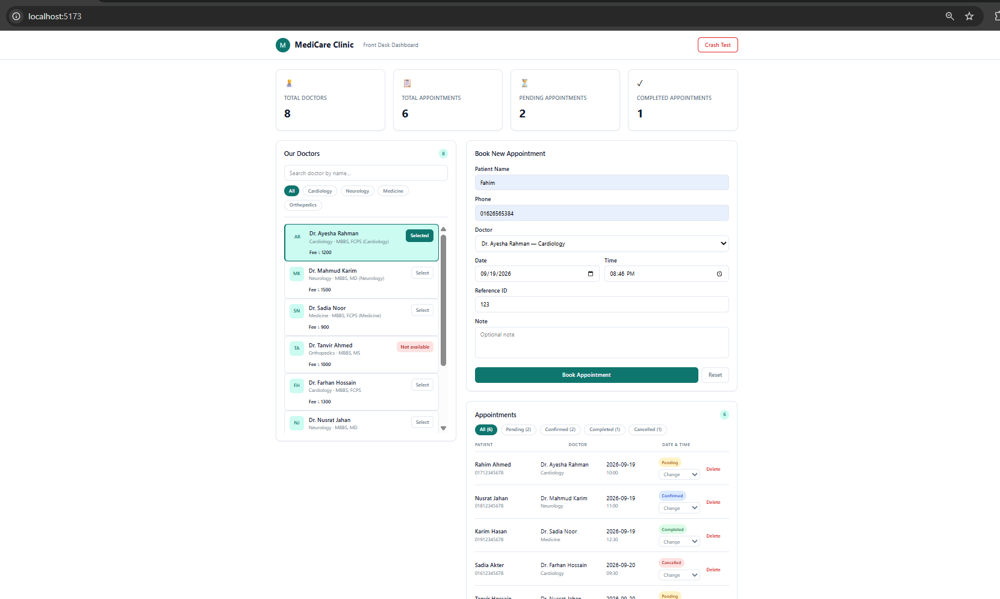
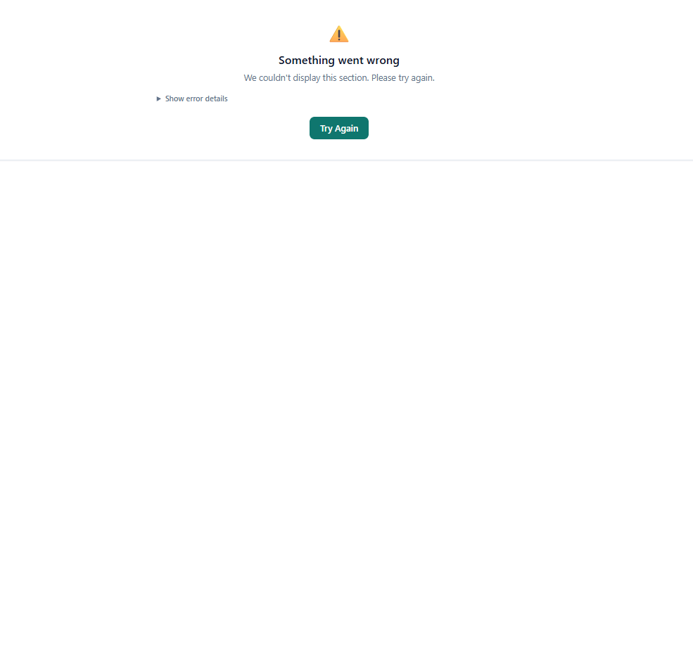

# MediCare Clinic — Appointment Dashboard

A frontend-only clinic appointment dashboard built with **React + Vite** and **Tailwind CSS**.

## Features

- Dynamic doctor and appointment statistics
- Doctor search and department filtering
- Doctor selection with automatic form selection
- Controlled appointment form
- Uncontrolled Reference ID field using `useRef`
- Appointment validation and success feedback
- Appointment status updates and deletion
- Status filters with counts
- Empty states
- Error Boundary and fallback UI
- Crash Test button
- Global error logging

## Screenshots

Place your screenshots in a `screenshots/` folder:

```text
screenshots/
├── dashboard.png
├── booking.png
└── error-boundary.png
```

Then add:

```md



```

## Tech Stack

- React
- Vite
- Tailwind CSS
- JavaScript
- `useState`
- `useRef`
- Class Component for Error Boundary

## Setup

```bash
npm install
npm run dev
```

Production build:

```bash
npm run build
npm run preview
```

## Project Structure

```text
src/
├── assets/
├── components/
│   ├── layout/
│   │   ├── Header.jsx
│   │   ├── PageContainer.jsx
│   │   └── Footer.jsx
│   ├── ui/
│   │   ├── Card.jsx
│   │   ├── EmptyState.jsx
│   │   └── FilterableList.jsx
│   ├── stats/
│   │   ├── StatGrid.jsx
│   │   └── StatCard.jsx
│   ├── doctors/
│   │   ├── DoctorPanel.jsx
│   │   ├── DoctorFilter.jsx
│   │   ├── DoctorList.jsx
│   │   └── DoctorCard.jsx
│   ├── appointments/
│   │   ├── AppointmentForm.jsx
│   │   ├── AppointmentList.jsx
│   │   └── AppointmentRow.jsx
│   └── error/
│       ├── ErrorBoundary.jsx
│       ├── FallbackUI.jsx
│       └── CrashTest.jsx
├── data/
│   ├── doctors.js
│   └── appointments.js
├── utils/
│   ├── logger.js
│   └── validators.js
├── App.jsx
├── main.jsx
└── index.css
```

## React Concepts Used

| Requirement | Concept | Main File(s) |
|---|---|---|
| REQ-1 | `.map()` + stable keys | `DoctorList.jsx`, `AppointmentList.jsx` |
| REQ-2 | Ternary, `&&`, switch, IIFE | `DoctorList.jsx`, `AppointmentForm.jsx`, `AppointmentRow.jsx`, `Header.jsx` |
| REQ-3 | Lifting state up | `App.jsx` |
| REQ-4 | Props and callbacks | `DoctorPanel.jsx`, `DoctorList.jsx`, `AppointmentList.jsx` |
| REQ-5 | Composition / children | `Card.jsx`, `DoctorPanel.jsx` |
| REQ-6 | Render prop | `FilterableList.jsx`, `DoctorList.jsx`, `AppointmentList.jsx` |
| REQ-7 | Controlled components | `AppointmentForm.jsx` |
| REQ-8 | Uncontrolled component + `useRef` | `AppointmentForm.jsx` |
| REQ-9 | Prop drilling + solution | `App.jsx`, `DoctorPanel.jsx` |
| REQ-10 | Click and submit events | `DoctorCard.jsx`, `AppointmentRow.jsx`, `AppointmentForm.jsx` |
| REQ-11 | Error Boundary + Fallback UI | `ErrorBoundary.jsx`, `FallbackUI.jsx`, `CrashTest.jsx` |
| REQ-12 | Global error handling + logger | `main.jsx`, `logger.js` |

## Prop Drilling

`selectedDoctorId` is owned by `App.jsx` because both the doctor list and appointment form need the selected doctor.

The project demonstrates the prop-drilling problem and then removes unnecessary drilling using component composition and the `children` prop. `DoctorPanel` handles filtering while `App.jsx` keeps the shared selection state.

## Error Handling

The project includes:

- `ErrorBoundary` with `getDerivedStateFromError`
- `componentDidCatch`
- Reusable `FallbackUI`
- Try Again button
- Crash Test button
- Outer application Error Boundary
- Separate appointments-panel Error Boundary
- `window.onerror`
- `unhandledrejection`
- Centralized logging in `utils/logger.js`
- `try/catch` in the appointment submit handler

An Error Boundary alone does not catch event-handler errors, asynchronous errors, or errors outside React rendering, so global handlers and `try/catch` are also used.

## Data

All data is hard-coded locally in:

- `src/data/doctors.js`
- `src/data/appointments.js`

No backend, database, REST API, `fetch`, or `axios` is used.

## Submission Checklist

- Public GitHub repository
- No `node_modules`
- At least 5 meaningful commits
- README with screenshots
- REQ-1 to REQ-12 mapping
- Prop Drilling explanation
- Error Handling explanation

## Author

**Fahim Shahriar**
